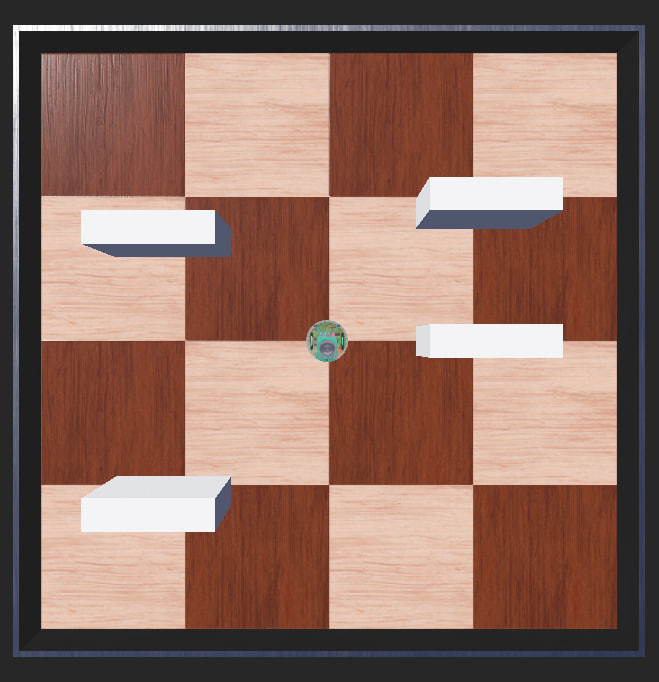
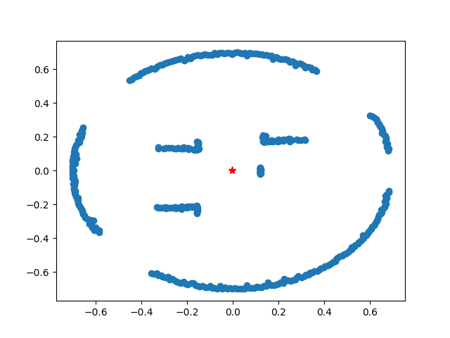
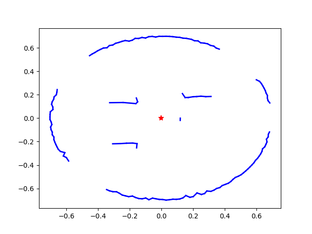
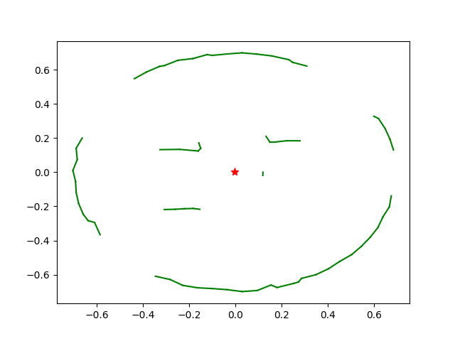

# Split & Merge Algorithm #
*Making a map of the environment using lidar sensors and Split & Merge algorithm*

**The actual environment**

**obtained data using one lidar sensor and a 360-degree spin**

**Result after Spliting the lines**

**Result after Merging the lines**

